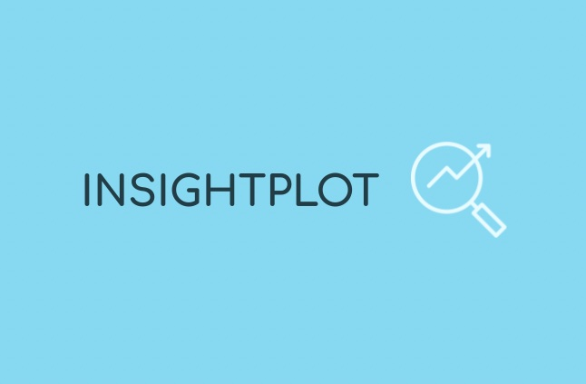

# ⚠️ Currently under development
<h1 align="center">
  InsightPlot
  

</h1>

<h4 align="center">Visualize Your Sensor Data with Ease</h4>

  <a href="#key-features">Key Features</a> •
  <a href="#download">Download</a> •
  <a href="https://www.instagram.com/fokusstacking/">About</a> •
  <a href="#contribute">Contribute</a>

### An iOS App to help users gain insights, analyse, and visualise data form sources like ThingSpeak.

Welcome to InsightPlot, an intuitive and powerful app designed to bring your sensor data to life. With InsightPlot, you can effortlessly visualize your data from various sources, providing you with clear and meaningful insights at a glance. Whether you're a data enthusiast, a researcher, or an IoT enthusiast, InsightPlot is your go-to tool for exploring, understanding, and presenting your sensor data.

**Key Features:**

1. **Connectivity:** Seamlessly connect to your favorite databases, starting with the popular ThingSpeak API. Retrieve your sensor data with ease, ensuring that you have the most up-to-date information at your fingertips.
2. **Preview and Detailed Views:** Gain a comprehensive overview of your data with our intuitive preview, displaying all your datasets in a clean and organized manner. Dive deeper into the details with a zoomable and interactive interface that allows you to explore every aspect of your data.
3. **Customizable Widgets:** Customize your home screen and create widgets that fit your needs. From small circles that provide a quick glance at your sensor data to larger widgets that showcase detailed visualizations, you have full control over how you want to monitor and present your data.
4. **Real-Time Updates:** Stay up to date with real-time updates, ensuring that you are always aware of the latest changes in your sensor data. InsightPlot keeps you in the loop, enabling you to make informed decisions in real-time.
5. **Intuitive Data Exploration:** Effortlessly navigate through your data using our user-friendly interface. Filter and sort your data, compare different datasets side by side, and export your data for further analysis or sharing purposes.

**Get Ready to Visualize Your Sensor Data Like Never Before!**

InsightPlot empowers you to unlock the full potential of your sensor data. Whether you're monitoring environmental conditions, tracking health metrics, or exploring IoT data, InsightPlot provides you with the tools to visualize your data, spot trends, and gain valuable insights. With its intuitive interface, customization options, and seamless connectivity, InsightPlot is the ultimate companion for anyone working with sensor data.

**Start your journey today and bring your sensor data to life with InsightPlot!**
